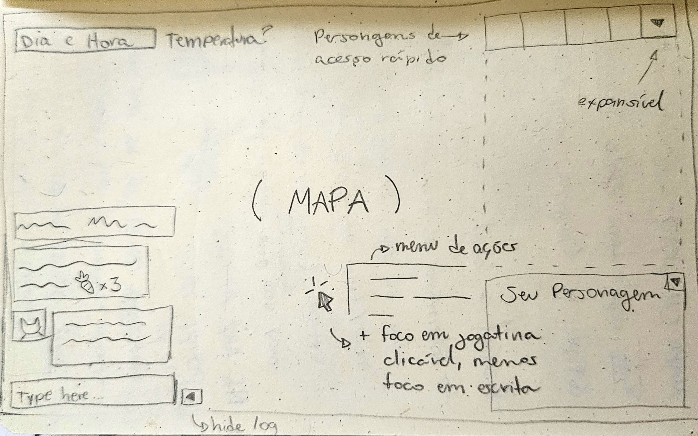

# UI

## Visão geral da interface

Rascunho de uma das primeiras versões da interface:

## Paleta de cores da interface de usuário

O objetivo é ser retrô. O preto é a cor do texto, o branco a cor de fundo e o azul forte no estilo "tela azul do Windows" para dar destaque a certas coisas. O vermelho mais puxado pro pastel pra dar suporte e contrastar um pouco.

## Fonte

A fonte é monoespaçada. A escolha exata ainda está sendo analisada, mas JetBrains Mono é a escolha neste momento do desenvolvimento.

## Mapa

### Array

Todo o mapa é desenhado com base em um array passado como argumento em `Map.draw()`. No array, é inserido o tipo de chão ou parede de cada quadrado e o próprio método escolhe variantes aleatórias para preencher. No caso de muro e outros objetos elevados, para diferenciar do chão que pode usar as mesmas texturas, a opacidade aplicada é maior.

Há outro array mais dinâmico para itens e animais sobrepostos (a ser implementado). Estes terão opacidade 1 para maior contraste.

### Tiles

O tileset do mapa é composto de imagens png de 30 pixels de altura por 30 pixels de largura. Devem ser nomeados de acordo com o range de sua categoria (a ser definido).

### Mapa não explorado

As porções do mapa não exploradas (não visitadas a um certo raio de distância do personagem), vão aparecer invisíveis (apenas o fundo sépia).
